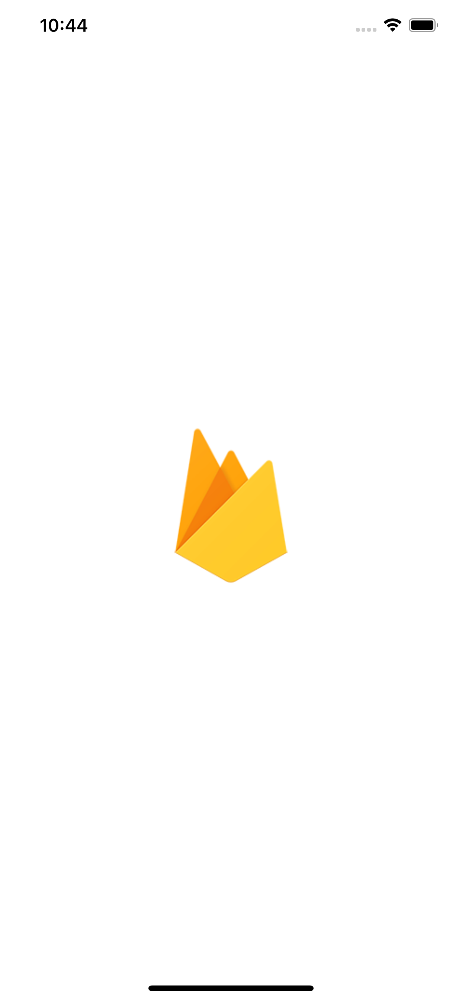
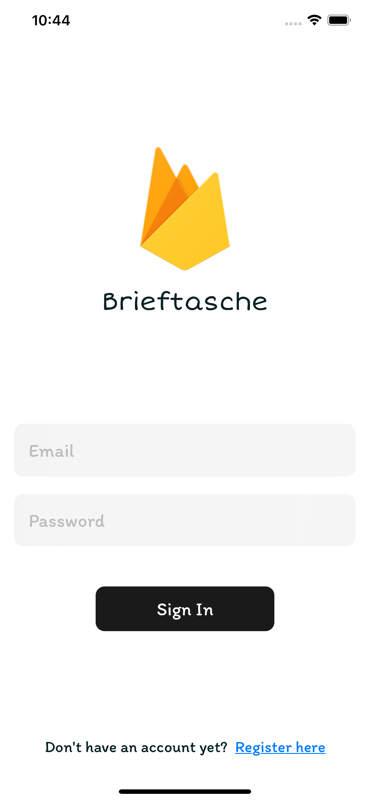
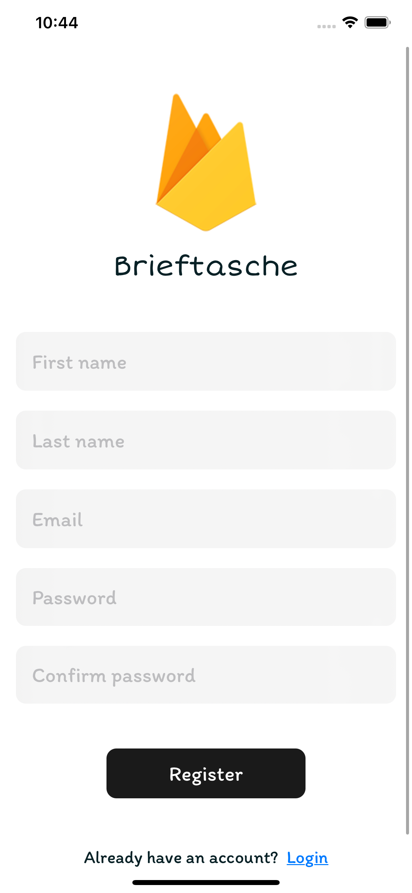
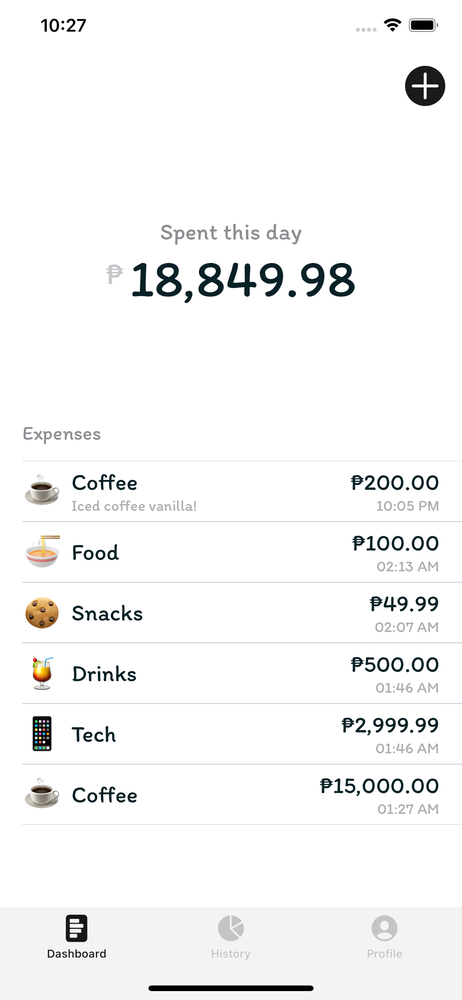
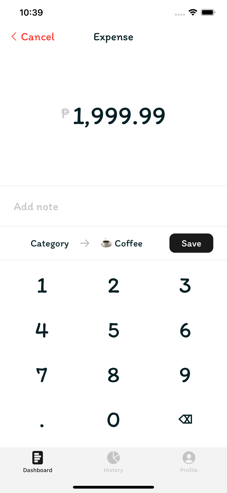
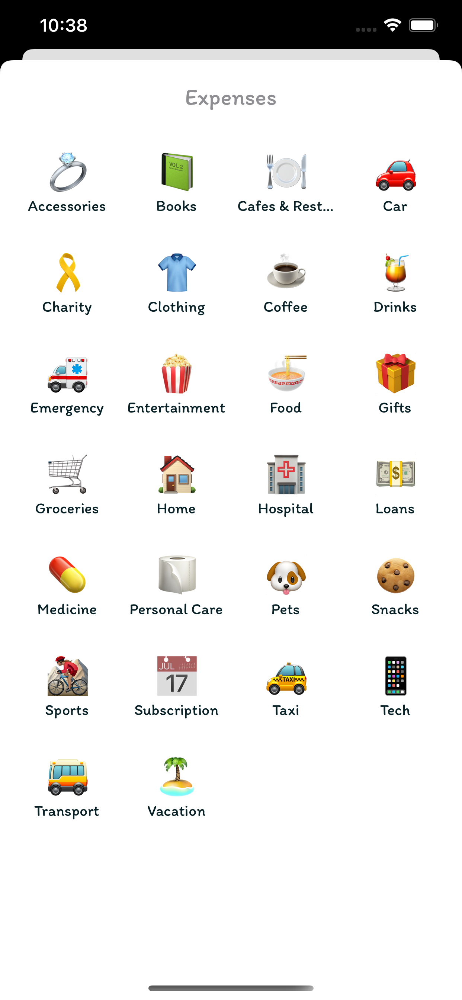
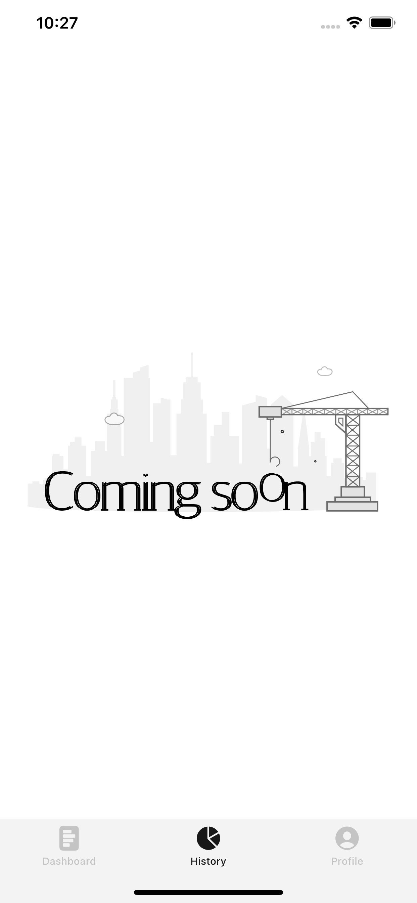
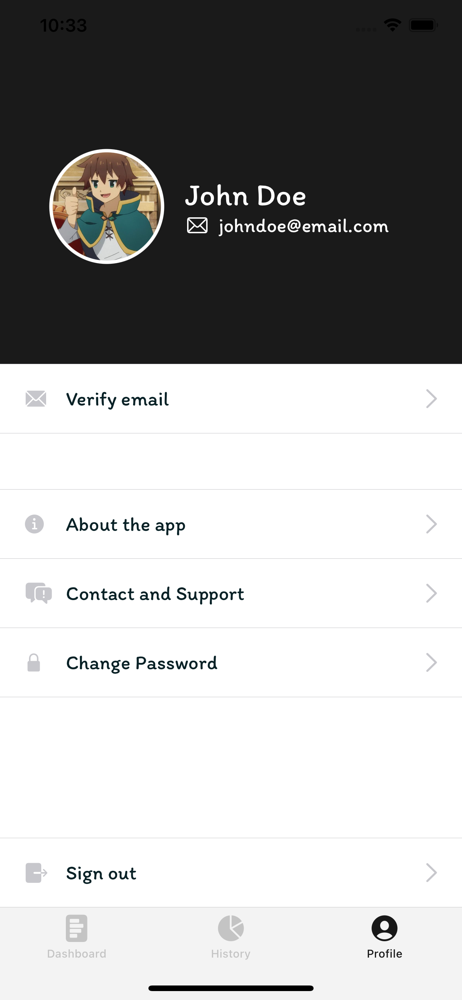

# Brieftasche

Brieftasche, track your expenses ~

## About
A wallet app written in Swift/SwiftUI.

## App Screenshots









## Todo List
- [x] Login screen
- [x] Register screen
- [x] Dashboard screen
- [x] Add expense screen
- [x] Profile screen
- [ ] History screen
- [ ] Change password functionality
- [ ] Email verification functionality
- [ ] Contact and support screen

## Setup
- Create a firebase project
- Configure the iOS app
- Download the `GoogleService-Info.plist` file
- Clone this repo then open the project in Xcode
- Drag and drop that file in the root directory of the project

## Installation
Open the project in Xcode

To run:
```
⌘ (Command/Cmd) + R
```
